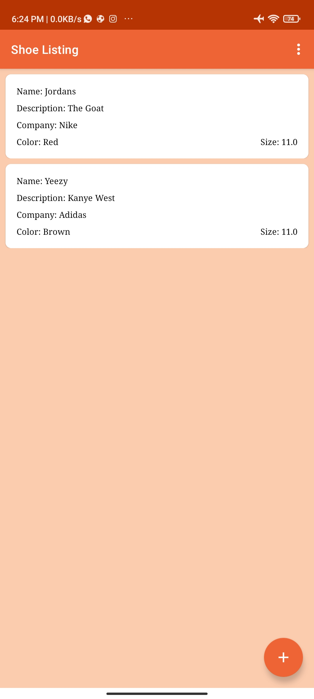
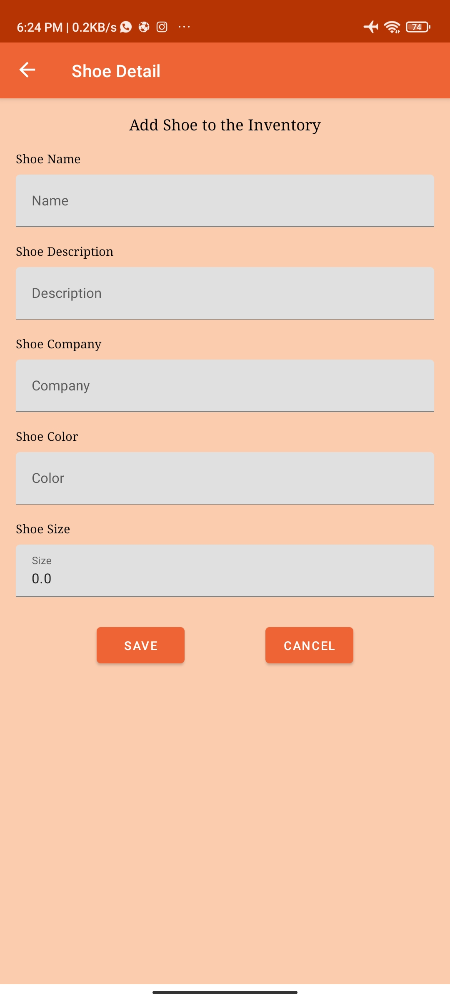

# Shoe Inventory App
The app is a multi-screened app that display a list of shoes added to the inventory, navigation between the screen was implemented using jetpack navigation component. 
This  is a project for the Udacity Android Kotlin Nanodegree Program.

## Libraries
- Navigation Component
- ViewModel
- LiveData
- Databinding
- Material Design Component

## Prerequisite
To build this project, you require:
- Android Studio artic fox
- Gradle 7.0

## Screenshots
<h4 align="center">

